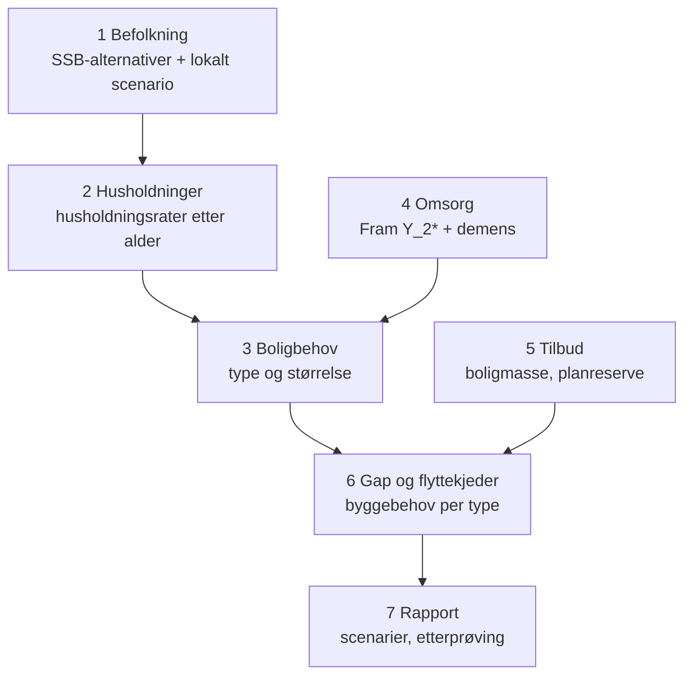

# Demografi i planverket til Buskerud-kommunene

Arbeidsnotat, oppdatert 2026-09-23. Lokal kopi av Claude-dokumentet
[Demografi i planverket – Buskerud](https://claude.ai/artifact/3MtVUyLVQZSWTgmw7TRJR1),
som er hovedversjonen. Bygger på 103 plandokumenter hentet og konvertert med
`skript/hent_planverk_buskerud.R`; dokumentliste, tekster og
demografiuttrekk ligger i `data/planverk/buskerud/` (se
[README](../data/planverk/buskerud/README.md)).

Flå og Nesbyen har det svakeste planverket for demografiske endringer, mens Drammen, Lier og Kongsberg er klart best. Notatet vurderer alle 18 kommuner på grunnlag av 103 plandokumenter og skisserer et felles planleggingsverktøy for bolig.

## Sammendrag

Vurderingen bygger på 103 dokumenter hentet fra kommunenes nettsider i september 2026: samfunnsdeler, planstrategier og kunnskapsgrunnlag, og etter en gjennomgang av hver kommunes planside også bolig- og boligsosiale planer, helse-, omsorgs- og demensplaner og folkehelseoversikter. Kommunene kan ha planer som ikke ligger på nett; der er vurderingen et minimum.

- **Drammen, Lier og Kongsberg er klart best.** De har egne eller alternative befolkningsframskrivinger (KOMPAS, Prognosesenteret), boligplaner koblet til framskrivingen og tallfestet behov for heldøgnsomsorg. Kongsberg regner for eksempel ut at 150 netto nye heldøgnsplasser trengs de neste ti årene for å holde dagens dekningsgrad.
- **Nore og Uvdal, Hol og Krødsherad er best blant de små kommunene.** De kombinerer scenarier eller tallfestet omsorgsbehov med egne boligplaner. Hemsedal har løftet seg med en ny bustadpolitisk plan 2025–2030.
- **Flå og Nesbyen har det svakeste planverket.** Ingen av dem har en gjeldende bolig- eller helse- og omsorgsplan på nett, og Flås samfunnsdel har nesten ingen demografisk analyse.
- **Ål, Hole og Rollag er svake på det overordnede nivået**, med gamle samfunnsdeler eller manglende planstrategi. Ål og Hole har likevel nye helse- og velferdsplaner (2025–2028 og 2026–2038) som tallfester aldringen godt.
- **Fire gjennomgående svakheter:**
  1. Befolkningsmål og prognose blandes. Hol, Gol og Hemsedal har mål om 5 000, 5 000 og 3 000 innbyggere i 2030, godt over SSBs framskriving.
  2. De fleste bruker bare SSBs hovedalternativ og drøfter ikke usikkerheten.
  3. Få regner om demografi til boligbehov etter type, og dekningsgraden for heldøgnsomsorg varierer fra 22 til 35 % av 80+ uten felles metode.
  4. Hyttekommunene tallfester ikke tjenestebehovet fra fritidsbeboere.
- **Et felles boligplanleggingsverktøy kan tette hullene for de små kommunene**, bygget som en utvidelse av Fram: fra befolkningsframskriving via husholdninger til boligbehov etter type, omsorgsboliger og planreserve, med scenarier.

## Vurderingsramme

Hver kommune er vurdert på seks dimensjoner. Skala: ● sterk, ◐ delvis, ○ svak eller mangler.

| Kode | Dimensjon | «Sterk» betyr |
| --- | --- | --- |
| A | Kunnskapsgrunnlag | Oppdatert og lokalt tilpasset, gjerne med delområder (grend, skolekrets) |
| B | Framskriving og usikkerhet | Flere alternativer eller scenarier, ikke bare SSB MMMM. Prognose skilt fra mål |
| C | Demografi → tjenester | Tallfestet behov for omsorg og skole: plasser, årsverk, dekningsgrad |
| D | Demografi → bolig og areal | Boligbyggeprogram og boligbehov etter type og livsfase, koblet til arealreserve |
| E | Oppfølging | Indikatorer og måltall som følges over tid |
| F | Aktualitet | Samfunnsdel og planstrategi fra de siste 3–4 årene |

## Oversikt

| Kommune | A | B | C | D | E | F | Samfunnsdel | Kort karakteristikk |
| --- | --- | --- | --- | --- | --- | --- | --- | --- |
| Drammen (3301) | ● | ● | ● | ● | ◐ | ● | 2021–2040 | KOMPAS per kommunedel, planreserve etter modenhet, temaplan boligutvikling 2023–2033 og strategi for bolig- og omsorgsbygg 2023–2032 |
| Kongsberg (3303) | ● | ● | ● | ● | ◐ | ● | 2026–2040 | Prognosesenteret med tre scenarier, boligsosial plan med 150 nye heldøgnsplasser på ti år, demografi per skolekrets |
| Ringerike (3305) | ◐ | ◐ | ◐ | ◐ | ○ | ◐ | 2021–2030 | Hønefoss-utredning 2025 med prognose per skoleområde, men ingen boligplan eller tallfestet omsorgsbehov |
| Hole (3310) | ◐ | ○ | ◐ | ◐ | ○ | ○ | 2018–2030 | Ny kommunedelplan velferd 2026–2038 (80+ fra 298 til 858 i 2050), men gammel samfunnsdel og ingen planstrategi funnet |
| Lier (3312) | ● | ● | ● | ● | ◐ | ◐→● | 2019–2028, ny 2040 på høring | KOMPAS med boligbyggeprogram, boligstrategi 2023–2027, 87 sykehjemsplasser innen 2034, demensplaner |
| Øvre Eiker (3314) | ◐ | ◐ | ◐ | ◐ | ◐ | ◐ | 2021–2033 | SSB middel har truffet godt, stedsprosjekter og mål om 1,4 % vekst; boligprogram nevnt, men ikke funnet |
| Modum (3316) | ◐ | ○ | ● | ◐ | ○ | ● | 2022–2032 | Helse- og velferdsplan med dekningsgrad og kapasitetsanalyse, boligplan for unge; bare SSB-alternativ |
| Krødsherad (3318) | ● | ◐ | ◐ | ● | ● | ◐ | 2019–2032 | Indikatorsett, temaplan boligutvikling 2024–2033 (minst 10 boliger og 15 nye innbyggere per år), demensplan |
| Flå (3320) | ◐ | ○ | ○ | ○ | ○ | ◐ | 2022–2034 | Planstrategi på høring og folkehelseoversikt med framskriving, men ingen bolig- eller omsorgsplan |
| Nesbyen (3322) | ◐ | ○ | ◐ | ○ | ○ | ○ | 2018–2030 | Statistikk fra 2018 og folkehelseoversikt fra 2020; planlagt boligbyggeprogram ikke funnet |
| Gol (3324) | ◐ | ◐ | ◐ | ○ | ◐ | ○ | 2018–2030, ny 2026–2038 under arbeid | Flere SSB-alternativer, helse- og omsorgsplan 2017–2026; boligplanen (Hallingdal) er fra 2006 |
| Hemsedal (3326) | ◐ | ◐ | ○ | ● | ○ | ◐ | 2019–2030 | Bustadpolitisk plan 2025–2030 med kunnskapsgrunnlag, livsløpsstandard, buplikt og Ungbo |
| Ål (3328) | ○ | ○ | ● | ◐ | ○ | ○ | 2015–2027 | Eldste samfunnsdel, men ny helse- og omsorgsplan 2025–2028 med framskriving av tjenestemottakere og årsverk |
| Hol (3330) | ◐ | ○ | ● | ● | ◐ | ○ | 2018–2030 | Dekningsgrad fra 35 % til 22 %, boligstrategi og tettstedsanalyse for Geilo; mål om 5 000 innbyggere |
| Sigdal (3332) | ◐ | ● | ◐ | ◐ | ○ | ● | 2022–2035 | Fire Telemarksforsking-scenarier; ingen egen bolig- eller omsorgsplan funnet |
| Flesberg (3334) | ● | ◐ | ◐ | ◐ | ◐ | ● | 2025–2040 | Grundig kunnskapsgrunnlag, boligsosial strategi 2022–2026 med fylkets lavere prognose (2 848 mot SSBs 3 172 i 2050) |
| Rollag (3336) | ◐ | ◐ | ◐ | ○ | ○ | ◐ | 2023–2033 | Attraktivitetsmodell og demens, men ingen boligplan og siste planstrategi fra 2020–2023 |
| Nore og Uvdal (3338) | ● | ● | ● | ● | ◐ | ● | 2024 | Scenarier, årsverksmodell, temaplan boligutvikling 2023–2026, eiendomsstrategi og demensplan 2026–2031 |

## Kommune for kommune

For hver kommune: hva planverket har i dag, og hvordan kommunen kan styrke evnen til å planlegge for demografiske endringer.

### Drammen (3301)

**Status.** Drammen har det mest komplette planverket i fylket.

- Drammenstrender 2023: befolkning, husholdninger og forsørgerbrøk (0,31 i 2023, 0,43 i 2040). 80+ ventes doblet (4 656 til 8 554) og 90+ tredoblet til 2040.
- Egne framskrivinger i KOMPAS i to alternativer (trendflytting og boligtilbud) per kommunedel. Kommunen skriver åpent at både SSB og de egne framskrivingene har ligget over faktisk utvikling det siste tiåret.
- Planreserve på ca. 20 000 boliger, fordelt etter modenhet: 2 700 byggeklare, 2 600 med rekkefølgekrav uten avklart finansiering.
- Temaplan for boligutvikling 2023–2033 (vedtatt juni 2023) og strategi for bolig- og omsorgsbygg 2023–2032. Heldøgnstilbudet er i dag 454 langtidsplasser i institusjon og 129 boliger med heldøgns omsorg; strategien prioriterer hjemmetjeneste og tilpassede boliger foran nye institusjonsplasser.
- Ny temaplan for et aldersvennlig samfunn 2026–2029, og et boligstrategisk arbeid startet i 2025.

**Styrke:**

- Etterprøve framskrivingene systematisk. Når både SSB og KOMPAS har truffet for høyt, bør dimensjoneringen av heldøgnsomsorg justeres og treffsikkerheten dokumenteres.
- Tallfeste behovet for tilgjengelige boliger for 80+ per kommunedel. Strategien sier at nye boliger med heldøgns omsorg trengs, men antallet vurderes løpende i økonomiplanen.
- Knytte samfunnsdelen tydeligere til kunnskapsgrunnlaget med noen få måltall.

### Kongsberg (3303)

**Status.** Samfunnsdelen 2026–2040 er ny.

- Prognosesenteret (2025): kohort-komponent-framskriving med boligbygging, KDA-sysselsetting og bosettingsandel som drivere, i tre scenarier, og boligbehov for SSBs ni alternativer.
- Boligsosial plan 2023–2030: for å holde 2023-nivået på tilgang til bemannede boliger eller sykehjemsplasser for 80+ må kommunen bygge rundt 150 netto nye heldøgnsplasser de neste ti årene.
- Temaplan skolestruktur 2023–2030 med elevtallsprognoser og et vedlegg om demografi per skolekrets. Menon Economics peker på boligmarkedet som en av tre faktorer som begrenser tilflyttingen.
- Planstrategien legger til grunn ca. 200 nye boliger per år, og administrasjonen kaller selv anslaget høyt.

**Styrke:**

- Omsette boligbehovsberegningen til en boligtypemiks i arealdelen. Analysen viser at boligtype styrer alderen på tilflytterne.
- Koble behovet for 150 heldøgnsplasser til lokalisering per skolekrets eller bydel, med de samme demografidataene som skoleplanen bruker.
- Følge opp KDA-antakelsen (bosettingsandel 35–70 %) årlig, fordi den er største kilde til usikkerhet.

### Ringerike (3305)

**Status.**

- Bakgrunnsutredning for Hønefoss (2025): SSB MMMM gir 32 471 innbyggere i 2030, 34 003 i 2040 og 35 080 i 2050, og Norconsult har laget prognoser per skoleområde til 2038. Boligreserven i reguleringsplaner er over 1 600 enheter.
- Leve hele livet-handlingsplan (2021) viser fallende aldersbæreevne, men uten tallfestet kapasitetsbehov.
- Helhetlig boligpolitikk «for folk i alle livsfaser» og kompakt arealstrategi, men ingen egen boligplan eller planstrategi 2024–2027 ble funnet.

**Styrke:**

- Bruke prognosene per skoleområde også til omsorg og bolig, ikke bare skole.
- Lage en boligplan koblet til vekstgrensen og boligreserven på 1 600 enheter, med andel tilgjengelige boliger for eldre.
- Tallfeste behovet for heldøgnsplasser og tilrettelagte boliger fram mot 2040.

### Hole (3310)

**Status.** Samfunnsdelen er fra 2018, men kommunedelplan velferd 2026–2038 er ny.

- Velferdsplanen tallfester aldringen: 80+ øker fra 298 i 2024 til 858 i 2050, og 90+ fra 64 til 177. Den bygger på Demensplan 2040 og peker på behov for demensvennlige boliger med mulighet for heldøgns bemanning og «betydelige investeringer frem mot 2036».
- Samfunnsdelen legger til grunn «inntil 2 %» vekst (ca. 8 700 innbyggere i 2030) og sier at FRE16 gjør framskrivingen usikker.
- Planstrategien 2024–2027 ble ikke funnet, og siste boligsosiale handlingsplan gjaldt 2015–2019.

**Styrke:**

- Revidere samfunnsdelen og skille vekstmål fra planleggingsprognose, med scenarier for FRE16.
- Tallfeste investeringsbehovet i velferdsplanen: antall heldøgnsplasser og demensvennlige boliger per år fram mot 2036.
- Lage en ny boligplan som følger opp velferdsplanen, med tilgjengelige boliger på Sundvollen og Vik.

### Lier (3312)

**Status.** Lier er sammen med Drammen den mest modne kommunen.

- KOMPAS med boligbyggeprogram (realiserbar reserve 3 394 boenheter til 2040). Egen prognose gir 37 000 innbyggere i 2040, mot SSBs 32 000.
- Helhetlig boligstrategi 2023–2027: blant seniorer er det omtrent dobbelt så mange som kunne tenke seg leilighet som det som faktisk bor i leilighet.
- Temaplanen for helse, omsorg og velferd tallfester behovet for 87 nye sykehjemsplasser innen 2034. Temaplan (2024–2028) og handlingsplan (2025–2029) for demensomsorg, med forslag om et boligteam som hjelper eldre med å planlegge egen bolig.
- Skolebehovsanalysen bruker tre prognosealternativer (COWI, justert av Norconsult).

**Styrke:**

- Etterprøve den egne prognosen mot faktisk utvikling. Den ligger 5 000 over SSB.
- Tallfeste frigjøringseffekten, altså hvor mange eneboliger eldre faktisk forlater, og følge den opp gjennom boligteamet.
- Følge opp samfunnsdelen 2040 med få og målbare indikatorer.

### Øvre Eiker (3314)

**Status.**

- SSBs middelalternativ har truffet godt, og kommunen vil jobbe med prognoser for boligprogram og dimensjonering av tjenester.
- Konkrete boligprosjekter (Liesaga ca. 170 leiligheter, Hokksund Vest, Darbu, Fiskum), strategi for helse- og velferdstjenester 2025–2035 og mål om minst 1,4 % årlig vekst.
- Boligprogram og boligsosialt program er omtalt, men ble ikke funnet på nett, og den vedtatte handlingsdelen 2025–2028 er fjernet fra nettsiden.

**Styrke:**

- Sammenligne vekstmålet på 1,4 % med SSB-banen og vise konsekvensen for tjenestene hvis målet ikke nås.
- Tallfeste kapasitetsbehovet for institusjon og bemannede boliger i helse- og velferdsstrategien.
- Publisere boligprogrammet per tettsted, siden det er det som kobler vekstmålet til arealbruken.

### Modum (3316)

**Status.**

- Samfunnsdelen oppgir SSB-tall: 15 700 innbyggere i 2041, 95 % av veksten over 67 år, 80+ fra 711 til ca. 1 600, og fra 3,5 til ca. 2 i yrkesaktiv alder per pensjonist.
- Helse- og velferdsplanen (2021) bygger på en kapasitets- og behovsanalyse fra Telemarksforsking (2020). Dekningsgraden for heldøgnsomsorg er redusert fra 35 % i 2019, med mål om landsgjennomsnittet (28 %) i 2025, og over 85 % av innbyggerne over 80 år bor hjemme.
- Boligplan for unge i etableringsfasen (2023): ca. 7 200 helårsboliger, 70 % eneboliger.
- Bare SSBs hovedalternativ brukes, og planstrategien 2024–2027 ble ikke funnet.

**Styrke:**

- Lage en boligplan for eldre som supplement til planen for unge. Nesten all vekst er 67+, og boligmassen er dominert av eneboliger.
- Lage scenarier med lav og høy innflytting. Målet om vekst i yrkesaktive aldersgrupper krever at flyttevirkningen tallfestes.
- Innføre et indikatorsett etter mønster fra Krødsherad, med dekningsgraden som en av indikatorene.

### Krødsherad (3318)

**Status.**

- Samfunnsdelen fra 2019 bruker Telemarksforskings scenarier og peker på «stor risiko for nedgang».
- Planstrategien 2024–2027 har et indikatorsett (befolkning, boligbyggingstakt mot forventet, bostedsattraktivitet, arbeidsplasser).
- Temaplan helhetlig boligutvikling 2024–2033 med konkrete mål: minst 10 nye boliger og 15 nye innbyggere per år, større kommunal rolle i eiendomsutviklingen og aldersvennlige og flergenerasjonsløsninger.
- Demensplan 2023–2027. Folkehelseoversikten anslår at demensandelen øker fra 2,17 % (48 personer) i 2020 til 4,84 % i 2050.

**Styrke:**

- Oppdatere samfunnsdelen med indikatorene og boligmålene.
- Tallfeste behovet for omsorgsboliger og heldøgnsplasser ut fra demensframskrivingen. Demensplanen har tiltak, men ikke kapasitetstall.
- Følge opp målet om 10 boliger per år mot boligtype, slik at noen av dem er tilgjengelige for eldre i Noresund og Krøderen.

### Flå (3320)

**Status.**

- Samfunnsdelen 2022–2034 har ingen framskriving og ingen omtale av aldring eller tjenestebehov, og målet er «et folketall som bidrar til å nå våre mål».
- Planstrategien 2024–2027 (høringsutgave) og folkehelseoversikten 2024–2027 viser en høy andel aleneboende over 45 år og at antallet over 80 år nesten dobles fram mot 2050.
- Kommunen har et tilskudd til unge boligsøkende, men ingen bolig-, helse- og omsorgs- eller demensplan ble funnet.

**Styrke:**

- Ta demografien fra folkehelseoversikten inn i samfunnsdelen og planstrategien, med SSB-alternativer og forsørgerbrøk.
- Lage en enkel boligplan: antall, type og kommunale tomter, med tilgjengelige boliger for eldre.
- Tallfeste tjenestebehovet for fastboende og hyttebefolkningen (ca. 2 400 hytter).

### Nesbyen (3322)

**Status.** Samfunnsdelen er fra 2018, med et statistikkhefte.

- Folkehelseoversikten (2020) viser nedgang fra 3 270 innbyggere i 2020 til 2 925 i 2040, mens 80+ nesten dobles (212 til 417).
- Kommunen har 71 omsorgsboliger med heldøgns omsorg og 13 institusjonsplasser.
- Et boligbyggeprogram og flere eldreboliger var planlagt i 2018, men ingen boligplan eller helse- og omsorgsplan ble funnet på nett.
- Planstrategien 2024–2027 er skrevet i en ROBEK-situasjon og utsetter flere planbehov.

**Styrke:**

- Gjøre ferdig revisjonen av samfunnsdelen (startet 2025) med oppdatert framskriving og scenarier.
- Lage boligbyggeprogrammet som var planlagt i 2018, med eldreboliger.
- Knytte demensframskrivingen til dimensjonering av omsorgsboligene, siden kommunen allerede er «boliggjort».

### Gol (3324)

**Status.**

- Planstrategien 2024–2027 viser flere SSB-alternativer (+3,8 % i 2025–2045 i hovedalternativet, +13 % ved høy vekst) og nedgang på ca. 200 (−8 %) i alderen 20–66.
- Kommunedelplan helse og omsorg 2017–2026 bygger på en faktarapport fra Deloitte og anslår ca. 92 personer med demens i 2030. Kommunen hadde 32 sykehjemsplasser og 43 omsorgsboliger.
- Målet om 5 000 innbyggere i 2030 er høyere enn SSBs hovedalternativ.
- Den eneste boligplanen er den felles bustadsosiale handlingsplanen for Hallingdal fra 2006.

**Styrke:**

- Bruke den nye samfunnsdelen (2026–2038) til å erstatte vekstmålet med scenarier.
- Lage en ny boligplan eller boligbehovsanalyse. Den regionale planen fra 2006 er utdatert, og Gol er vekstsenter med press på sentrumsnære boliger.
- Rullere helse- og omsorgsplanen, som går ut i 2026, med oppdatert framskriving.

### Hemsedal (3326)

**Status.**

- Bustadpolitisk plan 2025–2030 (vedtatt 20.11.2024) med kunnskapsgrunnlag og mulighetsstudie. SSB gir 2 989 innbyggere i 2030, med +116 over 67 år i 2030 og +470 i 2050, mot +212 i arbeidsfør alder.
- Planen prioriterer sentrumsnære enheter med livsløpsstandard, buplikt, Ungbo, tilvisningsavtaler og utredning av «hytte som mellombels bustad».
- Samfunnsdelen fra 2019 har en administrativ prognose på 1 % årlig vekst og mål om 3 000 innbyggere innen 2030.
- Ingen helse- og omsorgsplan ble funnet.

**Styrke:**

- Tallfeste behovet for omsorgsboliger og heldøgnsplasser når 67+ øker med 470 til 2050.
- Tallfeste tjenestebehovet fra deltidsbefolkningen, som Hemsedal selv peker på som en svakhet.
- Oppdatere samfunnsdelen med SSB-alternativer i stedet for den administrative prognosen.

### Ål (3328)

**Status.** Samfunnsdelen er fra 2015 og er den eldste i fylket, men helse- og omsorgsplanen er ny.

- Plan for helse- og omsorgstenester 2025–2028 framskriver tjenestemottakere per aldersgruppe: fra ca. 237 i 2021 til 336 i 2040 (+42 %), med +82 % for 80+, og behovet for årsverk i institusjon og hjemmetjeneste. Kommunen har 101 omsorgsboliger.
- Planstrategien fra 2024 (skannet) sier at folketallet er «kunstig høyt» på grunn av asylmottaket, at prognosene viser nedgang og at 80+ dobles innen 2050.
- Ål har kartlagt utbyggingsreservene (bare 46 % av avsatt areal er realisert) og gir tilskudd til unges første bolig, men har ingen boligplan.

**Styrke:**

- Revidere samfunnsdelen i perioden, slik planstrategien selv anbefaler, og bruke framskrivingen fra helse- og omsorgsplanen som felles grunnlag.
- Lage en boligplan som bruker kartleggingen av utbyggingsreserver og prioriterer sentrumsnære, tilgjengelige boliger. Ål mangler byggeklare sentrumsnære kommunale tomter.
- Koble økningen i tjenestemottakere til behovet for omsorgsboliger utover dagens 101.

### Hol (3330)

**Status.**

- Kommunedelplanen for helse og omsorg 2025–2037 foreslår å redusere heldøgns dekningsgrad fra 35 % til 22 % av 80+.
- Boligstrategien har folketall per grend (2000–2021) og vekt på universell utforming for eldre, og tettstedsanalysen for Geilo viser boligreserver og byggeaktivitet per sone.
- Planstrategien 2024–2027 viser at andelen 67+ gikk fra 20 % i 2020 til 22 % i 2024.
- Målet om «minst 5 000 innbyggere i 2030» fra 4 491 i 2024 krever ca. 1,8 % årlig vekst. Samfunnsdelen fra 2018 anslår selv 4 560 i 2030.

**Styrke:**

- Skille vekstmålet fra planleggingsgrunnlaget og dimensjonere tjenester og infrastruktur ut fra SSB-banen.
- Koble dekningsgraden på 22 % til et konkret behov for tilrettelagte boliger per grend (Geilo mot de mindre grendene) i boligstrategien.
- Revidere samfunnsdelen fra 2018.

### Sigdal (3332)

**Status.**

- Samfunnsdelen 2022–2035 og planstrategien 2024–2027 bruker fire Telemarksforsking-scenarier og SSB. Alle viser nedgang.
- 67+ ventes å øke med ca. 27 % og grunnskolealder å gå ned med ca. 26 % til 2036. Antall 20–66 år per person over 66 går fra 2,3 i 2020 til 1,1–1,4 i 2050.
- Få kommunale tomter, boligbygging 4,3 per 1 000 innbyggere mot 5,2 i landet, og ca. 5 000 fritidsboliger.
- En boligsosial handlingsplan er ny i planstrategien, men ingen bolig- eller helse- og omsorgsplan ble funnet.

**Styrke:**

- Bruke scenariene til konkrete beslutninger om skolestruktur og omsorgskapasitet («pukkelkostnad»).
- Ta inn tilgjengelige boliger for eldre i Prestfoss og Nerstad i den nye boligsosiale handlingsplanen.
- Innføre indikatorer for boligbygging og flytting, slik Krødsherad har gjort.

### Flesberg (3334)

**Status.**

- Samfunnsdelen 2025–2040 og kunnskapsgrunnlaget er grundige: husholdninger, eierandel (80 %), demens fra 74 personer i 2025 til 129 i 2040, og forsørgerbrøk.
- Boligsosial strategi 2022–2026 viser to prognoser: SSB gir 3 172 innbyggere i 2050, fylkeskommunen 2 848.
- Lampeland-prosjektet skal gjøre kommunen attraktiv for arbeidskraften som Kongsberg-industrien henter inn. Flesberg er ROBEK-kommune.

**Styrke:**

- Bruke fylkets lavere prognose aktivt som lavt scenario i dimensjoneringen, og teste veksten mot Prognosesenterets scenarier for Kongsberg.
- Følge opp den boligsosiale strategien med en temaplan for tilpassede boliger (arbeidet startet i 2021).
- Dimensjonere demensplasser og bemannede boliger ut fra demenskartet.

### Rollag (3336)

**Status.**

- Samfunnsdelen 2023–2033 bruker Telemarksforskings attraktivitetsmodell. Utfordringen er utflytting, og fødselsunderskuddet gjør kommunen avhengig av innflytting.
- 35 % av innbyggerne er 60 år eller eldre, mot 24 % nasjonalt. 80–89 år ventes å øke kraftig etter 2025, og demensandelen er 3,17 %.
- 86 % av boligene er eneboliger. Ingen boligplan eller helse- og omsorgsplan ble funnet, og siste planstrategi er fra 2020–2023.

**Styrke:**

- Vedta en ny planstrategi med oppdatert kunnskapsgrunnlag.
- Lage en boligplan med boligtyper utover eneboliger, slik at eldre har noe å flytte til og eneboliger frigjøres til tilflyttere.
- Tallfeste omsorgsbehovet for 80–89 år fram mot 2040.

### Nore og Uvdal (3338)

**Status.**

- Kommuneplangrunnlaget 2024–2027 har Telemarksforskings fire scenarier (1 815–2 128 innbyggere i 2050, mot SSBs 2 261) og en årsverksmodell for 2040 (−5 barnehage, −11 skole, +30 pleie og omsorg).
- Temaplan boligutvikling 2023–2026 bygger på de samme scenariene. Eiendomsstrategien sier at kommunen «neste 10 år står foran en stor endring i behov for tilrettelagte boliger for eldre», og kommunen disponerer 47 enheter i omsorgsbygg og 37 ordinære utleieenheter.
- Demensplan 2026–2031: 77 personer med demens i 2025 (3,11 %), med 21 nye tilfeller til 2030.
- Ca. 4 100 fritidsboliger; befolkningen varierer fra ca. 2 500 til 20 000.

**Styrke:**

- Tallfeste endringen i behov for tilrettelagte boliger som eiendomsstrategien peker på, og koble den til demensplanen.
- Tallfeste tjenestebehovet fra hyttebefolkningen, som legevakt og hjemmesykepleie i høysesong.
- Følge opp scenariovalget med indikatorer, slik at kommunen ser tidlig hvilket scenario den er på vei inn i.

## Hvilke kommuner mangler planverk?

**Klart svakest: Flå og Nesbyen.** Ingen av dem har en gjeldende bolig-, helse- og omsorgs- eller demensplan på nett, og planverket tallfester ikke hva aldringen betyr for tjenester og boliger.

- **Flå** har samfunnsdel (2022) uten demografisk analyse. Tallene finnes i folkehelseoversikten og planstrategien på høring, men er ikke omsatt til planer.
- **Nesbyen** har samfunnsdel fra 2018 og folkehelseoversikt fra 2020, og boligbyggeprogrammet som var planlagt i 2018 ble ikke funnet. Revisjonen startet i 2025.

**Svake på det overordnede nivået, men med nye sektorplaner: Ål, Hole og Rollag.** Ål (samfunnsdel 2015) og Hole (samfunnsdel 2018, ingen planstrategi funnet) har nye helse- og velferdsplaner som tallfester aldringen godt, men mangler boligplan. Rollag mangler både ny planstrategi og boligplan.

**Middels, med konkrete hull:** Ringerike har ingen boligplan eller planstrategi på nett, Gols boligplan er fra 2006, Sigdal har verken bolig- eller omsorgsplan, og Øvre Eikers boligprogram er ikke publisert.

**Hevet seg med de nye dokumentene:** Hemsedal (bustadpolitisk plan 2025–2030), Krødsherad (temaplan boligutvikling 2024–2033), Hol (boligstrategi), Modum (helse- og velferdsplan med dekningsgrad) og Nore og Uvdal (boligutvikling og eiendomsstrategi).

**Mønstre på tvers av kommunene:**

1. **Mål og prognose blandes.** Hol (5 000), Gol (5 000), Hemsedal (3 000), Hole (8 700) og til dels Øvre Eiker (1,4 %) setter vekstmål over SSB. Anbefaling: ett realistisk planleggingsgrunnlag og ett ambisjonsscenario.
2. **Bare SSB MMMM uten usikkerhet.** Drammen skriver at SSB har overvurdert veksten i ti år, og i Kongsberg var veksten i 2024 90 personer lavere enn MMMM anslo. Flere alternativer brukes i Drammen, Lier, Kongsberg, Sigdal, Nore og Uvdal, Gol, Ringerike (Norconsult per skoleområde) og Flesberg (fylkets prognose).
3. **Ni kommuner har nå en gjeldende bolig- eller boligsosial plan, men få regner om demografi til behov etter type.** Kongsberg (150 heldøgnsplasser), Lier (boligbyggeprogram), Krødsherad (10 boliger per år) og Hemsedal (framskriving per aldersgruppe) er nærmest. Ingen av de små kommunene regner på hvor mange eneboliger som frigjøres når eldre flytter.
4. **Dekningsgraden for heldøgnsomsorg varierer uten felles metode.** Hol går fra 35 % til 22 % av 80+, Modum fra 35 % mot landsgjennomsnittet på 28 %, mens Kongsberg og Lier planlegger for å holde dagens nivå. Hver kommune kjøper egne kapasitetsanalyser (Agenda Kaupang, Telemarksforsking, Deloitte, Prognosesenteret) med ulik metode.
5. **Deltidsbefolkning.** Ni kommuner med mange fritidsboliger tallfester ikke tjenestebehovet fra fritidsbeboerne. Hemsedal og Nore og Uvdal vurderer å bruke fritidsboliger som boliger.
6. **Delområder.** Drammen (kommunedeler), Lier og Kongsberg (skolekretser), Ringerike (skoleområder), Hol (grender) og Hemsedal (tettsteder) planlegger under kommunenivå.

## Skisse: planleggingsverktøy for bolig («Fram Bolig»)

De store kommunene kjøper eller lager det de trenger: KOMPAS (COWI) i Drammen og Lier, Prognosesenteret i Kongsberg. De små kommunene har verken ressurser eller data til det. Nordlandsforskning og NOVA fant i en kartlegging for Husbanken at det ikke finnes en felles definisjon av hva en boligbehovsanalyse skal inneholde, og at praksis og kapasitet varierer mye.

Gjennomgangen viser også at kommunene kjøper kapasitetsanalyser hver for seg med ulik metode: Agenda Kaupang (Lier), Telemarksforsking (Modum, Nore og Uvdal, Sigdal), Deloitte (Gol), Prognosesenteret og Menon (Kongsberg) og Norconsult (Ringerike, Lier). Resultatene kan derfor ikke sammenlignes, og dekningsgraden for heldøgnsomsorg spriker fra 22 til 35 % av 80+.

Et felles verktøy med standardisert metode og ferdige SSB-data gir alle kommunene et minimumsgrunnlag, og de som vil kan legge inn lokale forutsetninger som boligbyggeprogram og planreserve. Vestfold har gjort noe tilsvarende regionalt (regional boligbehovsanalyse 2025). Fram har allerede SSB-innhenting (07459 og befolkningsframskriving), 2024-kommunestruktur, demensandel, modeller for brukere av bolig og heldøgns omsorg (Y_2\*), usikkerhetsintervaller og Shiny-appen. Fram Bolig blir en utvidelse fra *hvor mange som trenger tjenester* til *hvilke boliger de trenger*.

Diagrammet viser hvordan befolkning og omsorg driver boligbehovet, som møtes mot tilbudet før rapportering.

1. **Befolkning.** SSBs framskriving i alle alternativene, ikke bare MMMM, slik Gol og Kongsberg bruker dem. Valgfritt lokalt scenario:
   - *Boligdrevet* for vekstkommuner: boligbyggeprogrammet gir tilflytting etter alder og boligtype (metoden fra KOMPAS og Prognosesenterets flyttestrømsanalyse).
   - *Attraktivitet* for distriktskommuner etter Telemarksforskings modell, som Sigdal, Krødsherad, Rollag og Nore og Uvdal allerede bruker.
2. **Husholdninger.** Standardmetoden med husholdningsrater: andelen personer i hver aldersgruppe som er hovedperson i en husholdning av gitt type. Kilde er SSBs registerbaserte husholdnings- og boforholdsstatistikk. Scenarier: konstante rater, eller videreført trend mot flere aleneboende (40 % av husholdningene i Drammen).
3. **Boligbehov etter type og størrelse.** En matrise gir sannsynligheten for enebolig, småhus eller leilighet og 1–2, 3–4 eller 5+ rom per alder og husholdningstype. Scenario A holder dagens mønster; scenario B justerer mot uttrykte preferanser (Buskerudbyen 2021: 60–70 % av seniorer og «tomt rede» ønsker leilighet).
4. **Omsorg og alderstilpassede boliger.** Frams framskriving av Y_2\* og demensandelen gir behovet for heldøgnsplasser og omsorgsboliger, med valgfri dekningsgrad (som Hols 35 % mot 22 % av 80+). Et «Bo trygt hjemme»-tillegg beregner tilgjengelige vanlige boliger for 75+ og 80+ som bor alene (Meld. St. 24 (2022–2023)).
5. **Tilbud.** Boligmasse etter bygningstype og rom, fullførte boliger, kommunale utleieboliger (KOSTRA) og fritidsboliger. Kommunen kan legge inn planreserve etter Drammens statusinndeling: uregulert, pågående regulering, byggeklar, regulert med rekkefølgekrav.
6. **Gap og flyttekjeder.** Årlig byggebehov per type = behov minus bestand, justert for avgang og for boliger som frigjøres når eldre flytter eller dør. Det gjør Liers og Drammens antakelse om flyttekjeder etterprøvbar, og viser om kommunen har nok byggeklare arealer av riktig type.
7. **Rapport og etterprøving.** Per kommune (valgfritt delområde) 2025–2050 med scenarier og usikkerhetsbånd, en fast rapport om hvordan tidligere SSB-framskrivinger har truffet, eksport til planstrategi, og et tillegg for deltidsbefolkning i hyttekommuner.

### Datagrunnlag, trinn og risikoer

| Tema | Kilde | Merknad |
| --- | --- | --- |
| Befolkning, historisk | SSB 07459 | Allerede i Fram |
| Befolkningsframskriving | SSB, alle alternativer (tabellen Fram bruker og 13600) | Utvid fra MMMM til alle alternativer |
| Husholdninger | SSB registerbasert husholdnings- og boforholdsstatistikk (bl.a. 09747, 06070) | Tabellnummer og variabler må verifiseres |
| Boligmasse og boligbygging | SSBs boligstatistikk (bygningstype, rom, fullførte) | Verifiseres; delområder via grunnkrets |
| Brukere av omsorg | Fram Y_2\* (SSB 11645, 12292 m.fl.) | Allerede i Fram |
| Demens | Fram og Demenskartet | Allerede i Fram |
| Fritidsboliger | SSB 05467 | |
| Boligpreferanser | Buskerudbyen 2021 (Opinion), NIBR/NOVA 2019 | Scenarioparametere |
| Planreserve og boligbyggeprogram | Kommunen (skjema) | Valgfritt, mal etter Drammens statusinndeling |
| Alternative prognoser | Buskerud fylkeskommune (Flesberg bruker fylkets prognose), KS Fremtidsverktøy (Hol) | Sammenligningsbaner ved siden av SSB |

**Leveranser i trinn:**

1. **Første versjon (kommunenivå, bare SSB-data):** demografisk boligbehov etter type i alle SSB-alternativene, og omsorgsbehov koblet til Y_2\*. Én ny fane i Fram. Dette alene gir Flå, Nesbyen, Rollag, Sigdal og Gol et bolig- og omsorgsgrunnlag på nivå med de mellomstore kommunene.
2. **Tilbud og gap:** boligmasse, boligbygging, frigjøringsmodell og et planreserveskjema kommunene fyller ut.
3. **Scenarier og delområder:** boligdrevet og attraktivitetsscenario, grunnkrets- og tettstedsnivå, tillegg for deltidsbefolkning.
4. **Etterprøving og oppfølging:** årlig oppdatering med indikatorer (boligbyggingstakt mot behov, andel tilgjengelige boliger, netto flytting etter alder), etter mønster fra Krødsherad.

**Faglige risikoer:**

- **Toveis årsakssammenheng mellom boligbygging og befolkning.** Bygging både følger og skaper etterspørsel (Prognosesenteret), så det boligdrevne scenarioet må presenteres som scenario, ikke prognose.
- **Husholdningsdannelse avhenger av priser og tilbud.** Konstante rater undervurderer behovet i pressområder og overvurderer i distriktene.
- **Små tall.** For kommuner under 2 000 innbyggere (Flå, Rollag, Nore og Uvdal) blir tall per type og år usikre; bruk intervaller og regionale rater (Hallingdal, Numedal).
- **Preferanser er ikke etterspørsel.** Undersøkelser overdriver viljen til å flytte, så scenario B bør vises som et øvre anslag.

## Kilder

Plandokumentene (103 stk.) er hentet fra kommunenes nettsider og pub.framsikt.net; liste med URL-er ligger i [manifest.csv](../data/planverk/buskerud/manifest.csv). Eksempler på de nye bolig- og omsorgsplanene: [Kongsberg, boligsosial plan 2023–2030](https://aimblob.blob.core.windows.net/aimfiles/dec50ec7-4c9a-48ad-bd00-5cf9f9ad0cd5.pdf), [Krødsherad, temaplan boligutvikling 2024–2033](https://www.krodsherad.kommune.no/_f/p12/i7a0e97bf-e178-4c41-9a4a-dfeff94429fa/temaplan-helhetlig-boligutvikling-2024-2033-hovedplan.pdf), [Hemsedal, bustadpolitisk plan 2025–2030](https://www.hemsedal.kommune.no/siteassets/bilder/hemsedal/bustadpolitisk-plan-2025-2030_vedteken201124.pdf), [Hole, kommunedelplan velferd 2026–2038](https://www.hole.kommune.no/download/18.5c2c56c219c98a23dd04954/1772711775859/Kommunedelplan%20Velferd%202026-2038%20(7).pdf), [Ål, helse- og omsorgsplan 2025–2028](https://www.aal.kommune.no/siteassets/dokumenter/plan-og-regulering/plan-for-helse--og-omsorgstenester-2025-2028.pdf) og [Drammen, strategi for bolig- og omsorgsbygg](https://www.drammen.kommune.no/politikk-samfunn/planer/bolig-og-omsorgsbygg-helhetlig-strategi-fremtidens-behov-2023-2032/innledning/). Annen litteratur og verktøy:

- COWI: KOMPAS – [systembeskrivelse (Narvik kommune)](https://www.narvik.kommune.no/_f/p28/if4567213-0ade-45eb-80cf-171046e82c77/vedlegg-3-kompas-systembeskrivelse.pdf)
- Prognosesenteret: [boligbehov basert på SSBs befolkningsframskriving](https://blogg.prognosesenteret.no/oppdatert-boligbehov-basert-paa-ssbs-nye-befolkningsframskriving), og [rapporten for Kongsberg (2025)](https://aimblob.blob.core.windows.net/aimfiles/45a6121b-fc2e-4527-a0b4-655caa813f64.pdf)
- Nordlandsforskning og OsloMet NOVA: *Kommunale analyser av boligbehov og boligmarked*, for Husbanken – [Husbanken, rapporter](https://www.husbanken.no/rapporter/)
- OsloMet NIBR/NOVA: [Mobilitet blant eldre på boligmarkedet](https://www.oslomet.no/forskning/forskningsprosjekter/mobilitet-blant-eldre-boligmarkedet) ([rapport](https://biblioteket.husbanken.no/arkiv/dok/Komp/Mobilitet%20blant%20eldre%20pa%20boligmarkedet.pdf))
- Husbanken: [Boligbehovsanalyser i Oslo-Akershus-regionen](https://biblioteket.husbanken.no/arkiv/dok/Komp/Boligbehovsanalyser%20i%20Oslo%20Akershus%20regionen.pdf)
- Vestfold fylkeskommune: [Regional boligbehovsanalyse 2025, vedlegg om sosiale boformer](https://www.vestfoldfylke.no/globalassets/vfk---hovednettsted/dokumenter/samfunnsutvikling/samfunn-og-plan/regionale-planer/rpba/regional-boligbehovsanalyse-2025/vedlegg-4-_handlingsrom-og-virkemidler_sosiale-boformer--asplan-viak-070325.pdf)
- Regjeringen: [Analyse av begrepet «tilstrekkelig boligbygging»](https://www.regjeringen.no/contentassets/2ae852c304d4437dabaaf9762a9e5359/analyse-av-begrepet-tilstrekkelig-boligbygging-pdf.pdf)
- SSB: [Samordnet statistikk for husholdninger og boliger](https://www.ssb.no/befolkning/samordnet-statistikk-for-husholdninger-og-boliger), [Boforhold, registerbasert](https://www.ssb.no/bygg-bolig-og-eiendom/statistikker/boforhold/aar)
- Drammen kommune: [Drammenstrender 2023](https://www.drammen.kommune.no/globalassets/politikk-og-samfunn/planer/dokumenter/drammenstrender-2023.pdf) (gjengir Buskerudbyens boligpreferanseundersøkelse 2021)
- Lier kommune: [Kunnskapsgrunnlag 2023](https://www.lier.kommune.no/globalassets/10.-politikk-og-samfunn/samfunn/planer/planer-og-rapporter/kunnskapsgrunnlag-2023-for-lier-kommune.pdf)
